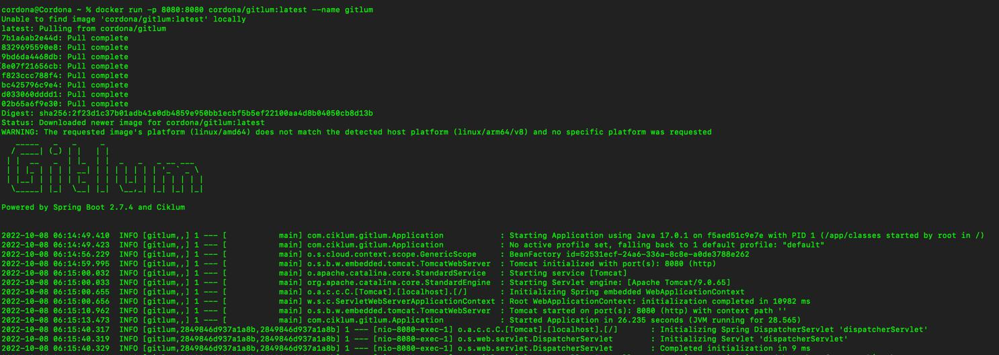
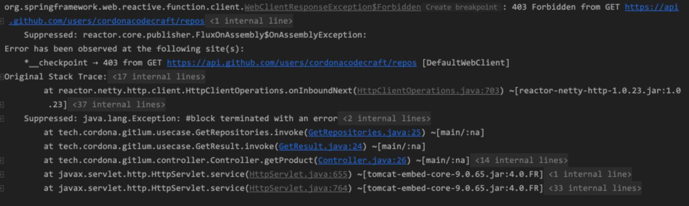
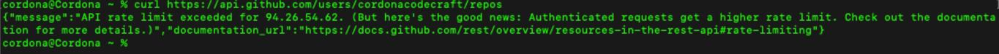
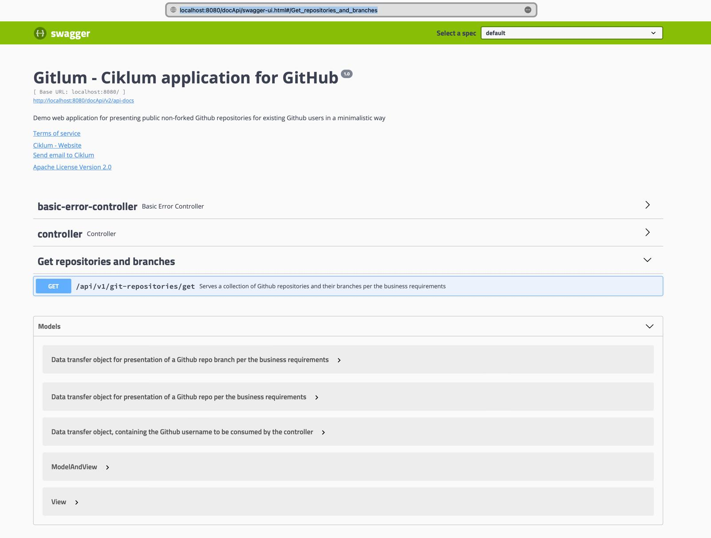
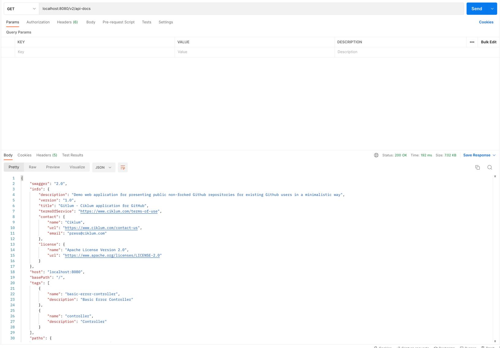

= Gitlum - Ciklum application for GitHub

== Backstory

Volodymyr, a delivery manager, recently joined https://www.ciklum.com[Ciklum] and wants to track his teammates' public GitHub repositories to improve the delivery rates of his team. It appears that some developers are contributing to projects outside Ciklum during business hours.

GitHub is too verbose when serving data about repositories and branches.

Still, the analytics require only a fraction of the output - the repository name, owner login, and for each branch - its name and last commit sha.

The delivery manager assigned one of the software engineers to develop a solution.

Volodymyr is tech-savvy and prefers to run the application as a docker container deployed in a public Docker registry.

Soon Gitlum was born - a ##**Git**##Hub application for Cik##**lum**## teams.

== Dev task description and GitHub repository of the solution

. https://drive.google.com/file/d/1j0LXyeLcMsDrXvFvnt25a0jbFw5QDoOW/view?usp=sharing[Backend Dev Task]
. https://docs.github.com/en/rest[Backing API]
. https://github.com/CordonaCodeCraft/gitlum[Dev task GitHub repository]

== Technology Stack

=== JDK

https://jdk.java.net/17/[JDK 17]

=== Build tool

https://gradle.org[Gradle]

=== Spring boot

https://spring.io/projects/spring-boot[Spring Boot 2.7.4]

=== Spring dependencies

. https://docs.spring.io/spring-boot/docs/current/reference/htmlsingle/#web[Spring Boot Starter Web]
. https://docs.spring.io/spring-framework/docs/current/reference/html/web-reactive.html[Spring Boot Starter webflux]
. https://spring.io/projects/spring-cloud-sleuth[Spring Boot Starter Sleuth]
. https://docs.spring.io/spring-boot/docs/1.5.7.RELEASE/reference/html/boot-features-testing.html[Spring Boot Starter Test]
. https://projectreactor.io/docs/core/3.3.12.RELEASE/reference/index.html#testing[Project Reactor Testing Framework]

=== Other libraries

. https://projectlombok.org/[Lombok]
. https://mapstruct.org/[MapStruct]
. https://swagger.io/[Swagger]
. https://joel-costigliola.github.io/assertj[Assert J]
. https://github.com/GoogleContainerTools/jib[Google Jib]

=== Additional tools

. https://www.jsoncrack.com/editor[Json to visual graphs]
. https://www.jsonschema2pojo.org[Json to Java POJO]
. https://www.codebeautify.org/jsontoxml[Json to XML]
. https://www.codebeautify.org/jsontoxml[Json to XML]
. https://www.grammarly.com[English to proper English]
. https://www.postman.com[Postman]

== How to start the application

Before starting the application make sure, that port `8080` is not being used by another process

=== Running the application locally

Download the application source code from https://github.com/CordonaCodeCraft/gitlum[here]

Unzip the archive file

Open the project with your favorite IDE (we hope this is https://www.jetbrains.com/idea/[Intellij] :)

Open your terminal at the root of the project and build it with the command
[source,bash]

----
./gradlew clean build
----

Always use the gradle wrapper. https://tomgregory.com/what-is-the-gradle-wrapper-and-why-should-you-use-it/[This article] explains why this is considered best practice.

Run the project

=== Spin up a docker container for running the application

You can start the application as a docker container, from an image built and deployed locally.

The application utilizes https://github.com/GoogleContainerTools/jib[Google Jib] for the purposes of building and deploying the docker image and all the required configuration is declared in the `build.gradle` script.

You can build and deploy locally the docker image with the command
[source,bash]

----
./gradlew jibDockerBuild
----

The name of the application's' image is `cordona/gitlum`

Validate that the image is successfully deployed locally by listing all the docker images with the bellow command
[source,bash]

----
docker image ls
----

Alternatively, you can locate the image in the UI of your Docker Desktop installation under "Images" in the left menu.

Start the container with this command
[source,bash]

----
docker run -p 8080:8080 --name gitlim cordona/gitlum:latest
----

=== Running the application from an image, deployed in a public Docker registry [RECOMMENDED]

We deployed the docker image in a publicly accessible Docker registry.

The easiest way to start the application is to simply execute the command
[source,bash]

----
docker run -p 8080:8080 --name gitlim cordona/gitlum:latest
----

Docker will automatically download the image and will start the container.
You can consume the API immediately after the application starts.

== Using the application

Since this application is an http://theleanstartup.com[MVP], we implemented a single `GET endpoint`, which you can hit in your favorite REST client:

``localhost:8080/api/v1/git-repositories/get
``

The endpoint is expecting a JSON payload in the request's body, containing the name of a GitHub user:

[source,Json]
----
{"gitUser":"your-github-user"}
----

Upon success (GitHub user is present), the endpoint returns his public not forked repositories and their branches, formatted per the business requirements:

[source,Json]
----
[
    {
        "repositoryName": "amigoscode-microservices-demo",
        "ownerLogin": "CordonaCodeCraft",
        "branches": [
            {
                "branchName": "master",
                "lastCommitSha": "4fc77695a660bbae868f545554d5df09ee5cff27"
            }
        ]
    },
    {
        "repositoryName": "customer-service",
        "ownerLogin": "CordonaCodeCraft",
        "branches": [
            {
                "branchName": "master",
                "lastCommitSha": "dd5bce2d4a60f4dbe156ec8d20600e4df1210104"
            }
        ]
    },
    {
        "repositoryName": "DesignPatterns",
        "ownerLogin": "CordonaCodeCraft",
        "branches": [
            {
                "branchName": "master",
                "lastCommitSha": "3d15b404571bf3650665931be987a68369063edf"
            }
        ]
    },
    {
        "repositoryName": "eureka-server",
        "ownerLogin": "CordonaCodeCraft",
        "branches": [
            {
                "branchName": "master",
                "lastCommitSha": "dabfb547e9120fa87f2cac31a3dc085900ded98a"
            }
        ]
    },
    {
        "repositoryName": "gateway-service",
        "ownerLogin": "CordonaCodeCraft",
        "branches": [
            {
                "branchName": "master",
                "lastCommitSha": "856e64aa860662be88dd7ea68f57c818f4304d69"
            }
        ]
    },
    {
        "repositoryName": "gitlum",
        "ownerLogin": "CordonaCodeCraft",
        "branches": [
            {
                "branchName": "main",
                "lastCommitSha": "e51383e7c54d289e9534307b0db46990b201e8c5"
            }
        ]
    },
    {
        "repositoryName": "kickstart",
        "ownerLogin": "CordonaCodeCraft",
        "branches": [
            {
                "branchName": "master",
                "lastCommitSha": "265d395fe3bd33cdab4e063ae2ab244cad65a684"
            }
        ]
    },
    {
        "repositoryName": "limeburgerapp",
        "ownerLogin": "CordonaCodeCraft",
        "branches": [
            {
                "branchName": "main",
                "lastCommitSha": "a58b14a023f5300291ef1f750aa6d2b5c35a2357"
            },
            {
                "branchName": "master",
                "lastCommitSha": "5541f5d6e26d2d766e451f6b4203b8186d9d1656"
            }
        ]
    },
    {
        "repositoryName": "marketing-sandbox",
        "ownerLogin": "CordonaCodeCraft",
        "branches": [
            {
                "branchName": "master",
                "lastCommitSha": "da8362f8f5be0613a29150c7b2fc98553d31fbe7"
            }
        ]
    },
    {
        "repositoryName": "mssc-beer-service",
        "ownerLogin": "CordonaCodeCraft",
        "branches": [
            {
                "branchName": "circleci-project-setup",
                "lastCommitSha": "19363444f8e73060ba22ff7154af61df3172118d"
            },
            {
                "branchName": "main",
                "lastCommitSha": "b41d60035675758b27f1893b1713489ee9f9fc68"
            },
            {
                "branchName": "master",
                "lastCommitSha": "7aaa283d9e9fb92d328de2073a573e1f00e559f8"
            }
        ]
    },
    {
        "repositoryName": "multithreading",
        "ownerLogin": "CordonaCodeCraft",
        "branches": [
            {
                "branchName": "master",
                "lastCommitSha": "ef978a5360c83ef6fda7239e8a649a23f44c436e"
            }
        ]
    },
    {
        "repositoryName": "recipe-project",
        "ownerLogin": "CordonaCodeCraft",
        "branches": [
            {
                "branchName": "main",
                "lastCommitSha": "90d434c99dbbbc0493ed00d6a004f0fa74591a13"
            },
            {
                "branchName": "master",
                "lastCommitSha": "acc62cc080f2a4722772d987e9650689cb508da9"
            },
            {
                "branchName": "circleci-project-setup",
                "lastCommitSha": "b6317e99e7c224e4e4b1c982970555de96c2a838"
            }
        ]
    },
    {
        "repositoryName": "sfg-pet-clinic",
        "ownerLogin": "CordonaCodeCraft",
        "branches": [
            {
                "branchName": "main",
                "lastCommitSha": "b41977417d61e3bd9568ee3da31339f7f7353231"
            },
            {
                "branchName": "master",
                "lastCommitSha": "f1671bdfc114c1bdb4608619d9cfab972423cd33"
            }
        ]
    }
]
----

If GitHub user is not present, the application will handle the exception accordingly and will return Json object as follows:

[source,Json]
----
{
    "httpStatus": 404,
    "message": "Github user with username invalid-github-user not found"
}
----

If the request payload is not in the required format, the application will handle the exception accordingly and will return Json object as follows:

[source,Json]
----

{
    "statusCode": 406,
    "message": "Invalid content type (XML) provided. JSON content type required"
}
----

#*Important*#:

When consuming our API, consider that the backing GitHub API sets https://docs.github.com/en/rest/rate-limit[rate limits] for the requests you can execute per one astronomical hour (60 minutes).

Suppose you query GitHub users with many public non-forked repositories with many branches. You can consume your limit quickly or even fail to get the expected result with a `403` error.

When you exceed your rate limit, you will enjoy the bellow log output in your application:

In the terminal you can also confirm, that your rate limit is expired:

You can check your rate limits with the following terminal command:

[source,bash]
----
curl -I https://api.github.com/users/your-github-user-name
----

Expect the following terminal output:
[source,bash]
----
HTTP/2 403
date: Wed, 05 Oct 2022 10:08:59 GMT
server: Varnish
strict-transport-security: max-age=31536000; includeSubdomains; preload
x-content-type-options: nosniff
x-frame-options: deny
x-xss-protection: 1; mode=block
content-security-policy: default-src 'none'; style-src 'unsafe-inline'
access-control-allow-origin: *
access-control-expose-headers: ETag, Link, Location, Retry-After, X-GitHub-OTP, X-RateLimit-Limit, X-RateLimit-Remaining, X-RateLimit-Reset, X-RateLimit-Used, X-RateLimit-Resource, X-OAuth-Scopes, X-Accepted-OAuth-Scopes, X-Poll-Interval, X-GitHub-Media-Type, Deprecation, Sunset
content-type: application/json; charset=utf-8
referrer-policy: origin-when-cross-origin, strict-origin-when-cross-origin
x-github-media-type: github.v3; format=json
x-ratelimit-limit: 60
x-ratelimit-remaining: 0
x-ratelimit-reset: 1664967385
x-ratelimit-resource: core
x-ratelimit-used: 60
content-length: 277
x-github-request-id: FABC:912C:195465E:19C4BF6:633D57BB
----

== Swagger

The public API of the application is extensively documented with Swagger.

To consult with the documentation:

Start the application

In your favorite web browser open the http://localhost:8080/docApi/swagger-ui.html[*Swagger-ui*]

You can consume the Open API documentation of the project as JSON.
Simply perform http://localhost:8080/v2/api-docs[GET request] in your favorite REST client.
We recommend https://www.postman.com[Postman].

== Notes to the reviewer

=== Use cases

The project's author is passionate about clean architecture, propagated by https://en.wikipedia.org/wiki/Robert_C._Martin[Uncle Bob] in his https://www.amazon.com/Clean-Architecture-Craftsmans-Software-Structure/dp/0134494164[book], and the implementation of various services as https://blog.cleancoder.com/uncle-bob/2012/08/13/the-clean-architecture.html[use cases] and favoring https://medium.com/geekculture/composition-over-inheritance-7faed1628595[composition over inheritance].

This project is a demo of such an implementation. The author firmly believes that it enables the single responsibility principle on the extreme and proves that such a code base developed by this design pattern is a pleasure to test.

=== Almost reactive

The `RestTemplate` is considered deprecated. Hence `WebClient` is used to consume the backing GitHub API, but the application uses Tomcat and is not considered non-blocking from end-to-end.

=== Not exactly unit tests

The use cases and the controller are thoroughly tested but in a pure integration tests fashion. These tests are not considered actual unit tests since they depend on the entire Spring context and interaction with external APIs and systems.

This direct and non-optimal approach was favored due to the limited time for implementing the assignment.

For an actual production project, the author would prefer to utilize https://www.baeldung.com/bdd-mockito[BDDMockito] to sparingly mock the WebClient's responses and return collections of faked objects (with https://www.baeldung.com/java-faker[JavaFaker]).

== Additional resources

=== Recommended reading
- https://peternixey.com/post/83510597580/how-to-be-a-great-software-developer[How to be a great software developer]
- https://www.goodreads.com/book/show/3735293-clean-code[Clean code]
- https://echelonfront.com/extreme-ownership/[Extreme ownership]
- https://gettingthingsdone.com/what-is-gtd/[Getting things done]

=== Recommended watching
- https://www.youtube.com/watch?v=EZ05e7EMOLM[TDD, Where Did It All Go Wrong]
- https://www.youtube.com/watch?v=TBuIGBCF9jc[Make your bed]
- https://www.youtube.com/watch?v=IdTMDpizis8[Good]

"Do or do not. There is no try."

_Yoda_

